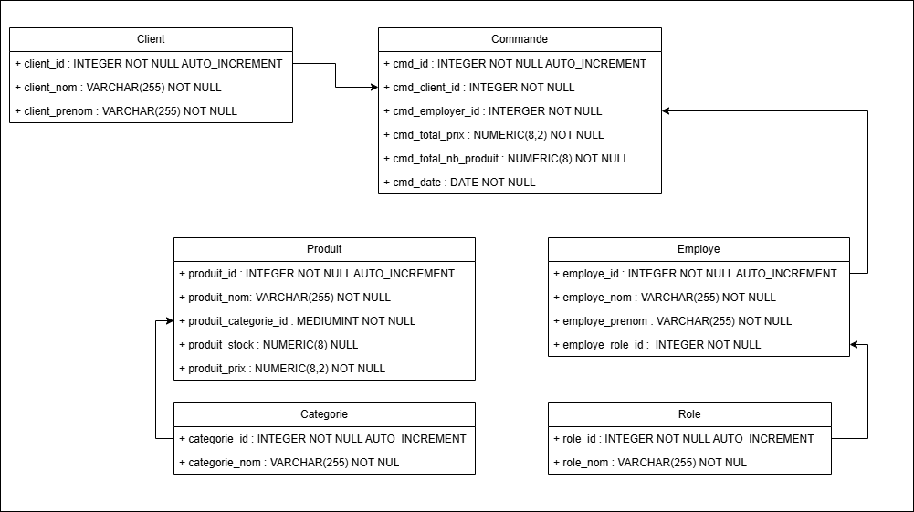

# Admin BDD TD FINAL

### Sujet : 

Mon projet était de créer une base de donnée d'un fast food type Mcdonald. J'ai créer une fonction pour update le nombres de commande faite par un utilisateur, update le nombre de stock d'un produit, ajouter une commande, une pour récuperer les statistiques d'un employer et une pour avoir une le récapitulatif d'une commande.

J'ai créer une utilisateur employer et un utilisateur manager.

Il y a une vue du top 3 des commandes client et une vue d'une top des employés.

Et enfin 3 selecteurs, une pour le recap des produits, une pour le recap de la plus grande commande de chaque utilisateur et une pour les stat des employés

### Diagramme UML : 

### Avis : 

Tous les sujets proposés était super cool, pour ce rendu, j'ai été ambicieux et est mal gerer mon temps. Par contre avoir un diagramme UML de tous les exercices permettrais d'avoir une meilleurs vision de la basse.